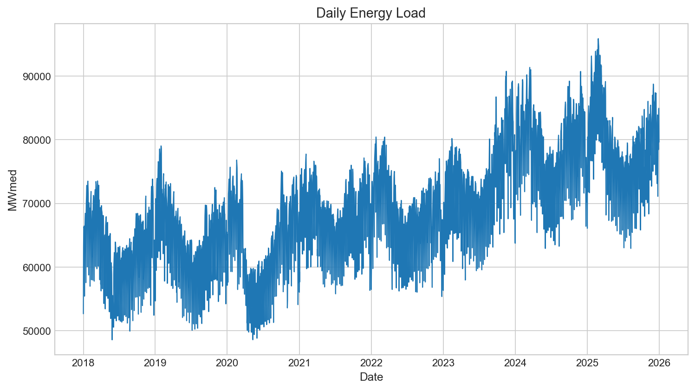
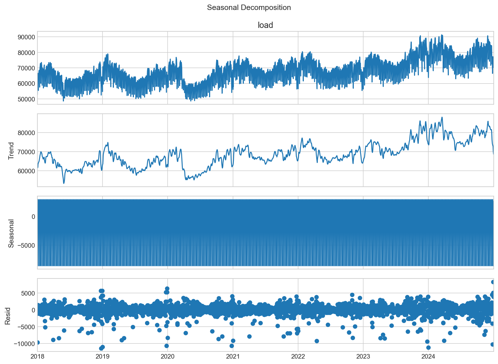
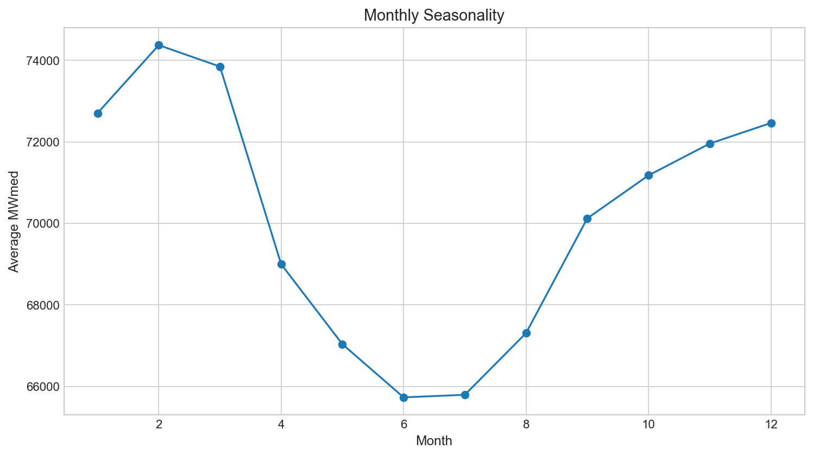
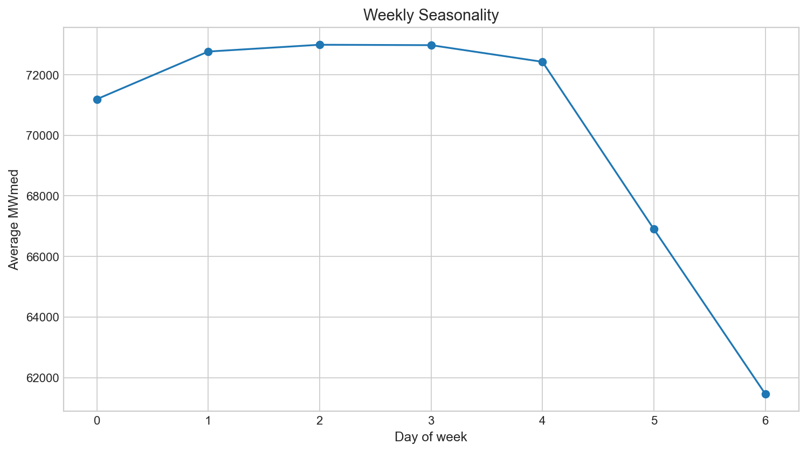
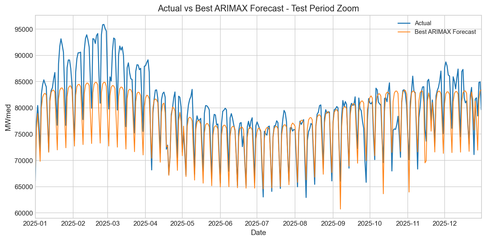
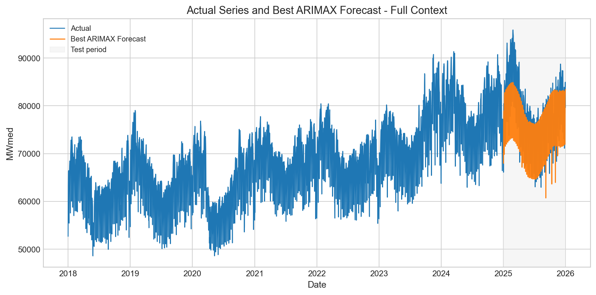
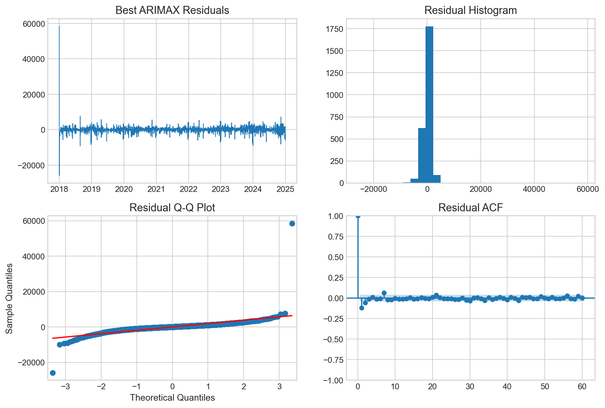

# Modelagem e Previsão da Carga Diária de Energia do Sistema Interligado Nacional com Modelos ARIMA e Variáveis de Calendário

## Resumo

A previsão da carga de energia elétrica constitui uma atividade essencial para o planejamento e a operação de sistemas elétricos, pois subsidia decisões relacionadas à programação da geração, à segurança operacional e à alocação de recursos. Este trabalho analisa a carga diária de energia do Sistema Interligado Nacional brasileiro entre 1º de janeiro de 2018 e 31 de dezembro de 2025, a partir de dados disponibilizados pelo Operador Nacional do Sistema Elétrico. O objetivo foi desenvolver, estimar e comparar modelos de séries temporais capazes de representar a dinâmica da demanda e produzir previsões para o ano de 2025. O período de 2018 a 2024 foi utilizado para estimação, enquanto 2025 foi reservado integralmente para avaliação fora da amostra. Foram considerados modelos ingênuos, ARIMA, SARIMA, ARIMAX, SARIMAX, GARMA e GARMAX. As variáveis exógenas incluíram efeitos de calendário conhecidos antecipadamente, como dia da semana, final de semana, mês, trimestre, feriados nacionais, véspera e dia posterior a feriados, início e fim do mês e termos harmônicos anuais. Os testes ADF e KPSS indicaram não estacionariedade da série em nível e estacionariedade após a primeira diferenciação. A análise exploratória revelou tendência crescente, sazonalidade anual e forte ciclo semanal, caracterizado pela redução da carga nos finais de semana. O modelo ARIMAX(2,1,2) apresentou o melhor desempenho preditivo no período de teste, com MAE de 2.811,07 MWmed, RMSE de 3.788,66 MWmed e MAPE de 3,41%. Os coeficientes estimados evidenciaram reduções significativas associadas a finais de semana, feriados e dias próximos a feriados. Apesar da superioridade preditiva, os testes de Ljung-Box indicaram autocorrelação residual remanescente. Conclui-se que a incorporação de variáveis de calendário melhora substancialmente a previsão da carga diária, embora extensões capazes de representar dependências residuais e múltiplas sazonalidades permaneçam relevantes.

**Palavras-chave:** séries temporais; previsão de carga elétrica; ARIMAX; SARIMA; variáveis de calendário; Sistema Interligado Nacional.

## 1. Introdução

A energia elétrica apresenta características particulares que tornam sua previsão um problema estatístico e operacional relevante. A demanda varia de acordo com o nível de atividade econômica, condições meteorológicas, hábitos de consumo, calendário civil e padrões sazonais. Como o equilíbrio entre geração e consumo deve ser mantido continuamente, erros de previsão podem produzir custos operacionais, comprometer a programação dos recursos de geração e reduzir a eficiência do planejamento energético.

Modelos de séries temporais são amplamente empregados nesse contexto porque permitem representar dependência temporal, tendência e sazonalidade. A metodologia Box-Jenkins fornece uma estrutura sistemática para identificação, estimação e diagnóstico de modelos autorregressivos integrados de médias móveis, ou ARIMA (Box et al., 2015). Em séries de carga elétrica, entretanto, parte importante da variabilidade está associada a fatores determinísticos conhecidos antecipadamente, sobretudo dia da semana, finais de semana e feriados. Modelos ARIMAX e SARIMAX ampliam a estrutura ARIMA ao incorporar regressoras exógenas, permitindo combinar a dinâmica estocástica da série com informações de calendário.

A literatura de previsão de carga enfatiza a importância de ciclos sazonais e efeitos de calendário. Taylor (2003, 2010) mostrou que a representação de múltiplas sazonalidades pode elevar substancialmente a precisão das previsões de demanda elétrica. Weron (2006) destaca que modelos de carga devem considerar tanto padrões recorrentes quanto eventos capazes de alterar temporariamente o consumo. Mais recentemente, Hong e Fan (2016) ressaltam a relevância da previsão de carga para o planejamento e a operação de sistemas elétricos, bem como a necessidade de avaliações reproduzíveis fora da amostra.

Este trabalho utiliza dados diários de carga de energia do Operador Nacional do Sistema Elétrico (ONS), abrangendo o período de 2018 a 2025. O objetivo principal é avaliar e comparar modelos estatísticos de previsão, com ênfase na contribuição das variáveis exógenas de calendário. A análise segue um procedimento temporal estrito: os dados de 2018 a 2024 são empregados na estimação, enquanto o ano de 2025 é mantido exclusivamente como conjunto de teste. A seleção final não se baseia apenas em critérios de informação, mas considera também precisão fora da amostra, parcimônia, interpretabilidade e diagnósticos dos resíduos.

## 2. Revisão Bibliográfica

### 2.1 Séries temporais e metodologia Box-Jenkins

Uma série temporal é uma sequência de observações indexadas no tempo cuja ordem contém informação relevante. Diferentemente de amostras independentes, observações temporais podem apresentar autocorrelação, tendência, sazonalidade e mudanças estruturais. Hamilton (1994), Chatfield (2000) e Shumway e Stoffer (2017) apresentam fundamentos teóricos e aplicados para a análise dessas estruturas.

A metodologia Box-Jenkins organiza a construção de modelos ARIMA em etapas iterativas de identificação, estimação e verificação diagnóstica (Box et al., 2015). Um modelo ARIMA \((p,d,q)\) combina \(p\) termos autorregressivos, \(d\) diferenciações e \(q\) termos de médias móveis. A diferenciação procura remover fontes de não estacionariedade, enquanto as componentes AR e MA representam dependência entre observações e inovações passadas.

Quando a série possui sazonalidade periódica, a formulação pode ser ampliada para um modelo SARIMA \((p,d,q)(P,D,Q)_s\), no qual \(s\) representa o período sazonal. No presente estudo, \(s=7\) foi adotado para representar o ciclo semanal da carga diária. A inclusão de regressoras exógenas resulta nos modelos ARIMAX e SARIMAX, úteis quando variáveis conhecidas antecipadamente explicam parte da dinâmica da série.

### 2.2 Estacionariedade e diagnóstico

A estacionariedade é uma condição central em grande parte da modelagem clássica de séries temporais. Em termos fracos, uma série estacionária apresenta média e variância constantes e autocovariância dependente apenas da defasagem. Para avaliar essa condição, foram utilizados os testes Augmented Dickey-Fuller (ADF) e KPSS. O teste ADF examina a hipótese nula de presença de raiz unitária (Dickey & Fuller, 1979), enquanto o KPSS utiliza como hipótese nula a estacionariedade (Kwiatkowski et al., 1992). A aplicação conjunta dos testes oferece evidência complementar para a decisão de diferenciação.

Após a estimação, a adequação do modelo deve ser examinada por meio dos resíduos. O teste de Ljung-Box avalia conjuntamente autocorrelações residuais em diferentes defasagens e permite verificar se o modelo capturou a dependência linear disponível (Ljung & Box, 1978). Resíduos compatíveis com ruído branco constituem uma propriedade desejável, embora a seleção de modelos de previsão também deva considerar o desempenho fora da amostra.

### 2.3 Seleção de modelos e avaliação de previsões

Os critérios de informação equilibram ajuste e complexidade. O AIC, proposto por Akaike (1974), penaliza o aumento do número de parâmetros com o objetivo de selecionar modelos com boa capacidade de aproximação. O BIC, derivado por Schwarz (1978), impõe penalização crescente com o tamanho da amostra e tende a favorecer modelos mais parcimoniosos. Entretanto, critérios de informação medem o ajuste dentro da amostra sob determinada especificação probabilística e não garantem o melhor desempenho preditivo fora da amostra.

Hyndman e Athanasopoulos (2021) recomendam que a avaliação de previsões preserve a ordem temporal e utilize dados não empregados na estimação. Entre as medidas usuais estão o erro absoluto médio (MAE), a raiz do erro quadrático médio (RMSE) e o erro percentual absoluto médio (MAPE). O MAE mede a magnitude média dos erros; o RMSE penaliza mais intensamente erros elevados; e o MAPE facilita a interpretação percentual, embora possua limitações quando há valores próximos de zero (Hyndman & Koehler, 2006).

### 2.4 Previsão de carga elétrica

A carga elétrica apresenta sazonalidades sobrepostas e forte sensibilidade a variáveis externas. Taylor (2003) demonstrou a importância da sazonalidade múltipla na previsão de demanda de curto prazo, enquanto Taylor (2010) ampliou essa discussão ao considerar métodos com três ciclos sazonais. Weron (2006) sistematiza abordagens estatísticas para cargas e preços de eletricidade, incluindo modelos autorregressivos e especificações com variáveis exógenas. Hong e Fan (2016) destacam que previsões de carga confiáveis são necessárias para planejamento de oferta, integração de fontes renováveis e decisões sob incerteza.

Nesse contexto, variáveis de calendário oferecem vantagens importantes: são conhecidas antes do horizonte de previsão, possuem interpretação direta e representam alterações recorrentes nos padrões de atividade. A inclusão dessas variáveis pode reduzir erros sistemáticos associados a finais de semana, feriados e períodos do ano.

## 3. Metodologia

### 3.1 Dados e preparação

Foram utilizados arquivos anuais de carga de energia diária do ONS entre 2018 e 2025. Os valores dos subsistemas foram somados diariamente para representar a carga total do Sistema Interligado Nacional. A base consolidada contém 2.922 observações diárias entre 1º de janeiro de 2018 e 31 de dezembro de 2025.

A rotina de preparação identificou automaticamente as colunas de data, subsistema e carga, converteu datas, ordenou as observações e verificou a continuidade diária. Não foram identificados dias ausentes antes da etapa de imputação. Os 11.688 registros originais dos subsistemas foram considerados válidos e agregados por soma.

A divisão temporal foi definida da seguinte forma:

- **treinamento:** 1º de janeiro de 2018 a 31 de dezembro de 2024, totalizando 2.557 observações;
- **teste:** 1º de janeiro de 2025 a 31 de dezembro de 2025, totalizando 365 observações.

Nenhuma observação de 2025 foi utilizada para estimação dos modelos. As previsões do horizonte de teste foram produzidas recursivamente ou por previsão de múltiplos passos, conforme a classe do modelo.

### 3.2 Variáveis exógenas

As regressoras exógenas do ARIMAX e do SARIMAX foram construídas exclusivamente a partir de informações conhecidas antecipadamente:

- dia da semana;
- indicador de final de semana;
- mês;
- trimestre;
- início e fim do mês;
- feriados nacionais brasileiros;
- véspera de feriado;
- dia posterior a feriado;
- termos de Fourier para representação suave da sazonalidade anual.

Por serem determinadas pelo calendário, essas variáveis não introduzem vazamento de informação do conjunto de teste.

### 3.3 Análise exploratória e estacionariedade

A análise exploratória incluiu série temporal, comparação anual, médias mensais e semanais, boxplots por mês, dia da semana e condição de feriado, decomposição sazonal, ACF e PACF. A estacionariedade foi examinada para a série original, transformação logarítmica, primeira diferença, diferença sazonal e combinações log-diferenciadas.

### 3.4 Modelos avaliados

Foram avaliados os seguintes modelos:

1. previsão ingênua recursiva;
2. previsão ingênua sazonal recursiva, com período semanal \(s=7\);
3. ARIMA;
4. ARIMAX com regressoras de calendário;
5. SARIMA com sazonalidade semanal;
6. SARIMAX com sazonalidade semanal e regressoras de calendário;
7. GARMA;
8. GARMAX.

A especificação GARMAX experimental combinou os efeitos de calendário com medidas de memória anual construídas exclusivamente a partir do período anterior conhecido. Essa extensão foi mantida na comparação de desempenho, mas o modelo final selecionado para interpretação e recomendação foi o ARIMAX com regressoras de calendário.

A busca ARIMA considerou \(p,q \in \{0,1,2\}\) e \(d \in \{0,1\}\). A busca SARIMA considerou adicionalmente \(P,D,Q \in \{0,1\}\) e período sazonal \(s=7\), totalizando 144 estruturas SARIMA. Falhas de convergência foram tratadas sem interromper a busca. Os modelos foram ranqueados por AIC e BIC, mas a recomendação final considerou prioritariamente a previsão fora da amostra.

### 3.5 Métricas de avaliação

As previsões foram avaliadas por:

\[
MAE = \frac{1}{n}\sum_{t=1}^{n}|y_t-\hat{y}_t|,
\]

\[
RMSE = \sqrt{\frac{1}{n}\sum_{t=1}^{n}(y_t-\hat{y}_t)^2},
\]

\[
MAPE = \frac{100}{n}\sum_{t=1}^{n}\left|\frac{y_t-\hat{y}_t}{y_t}\right|.
\]

Valores menores indicam maior precisão.

## 4. Resultados

### 4.1 Estatísticas descritivas e análise exploratória

A [Tabela 1](tables/descriptive_statistics.csv) apresenta as estatísticas descritivas da carga diária agregada.

**Tabela 1 — Estatísticas descritivas da carga diária, 2018–2025**

| Estatística | Valor (MWmed) |
|---|---:|
| Observações | 2.922 |
| Média | 70.103,87 |
| Desvio-padrão | 8.674,23 |
| Mínimo | 48.585,55 |
| Primeiro quartil | 63.761,02 |
| Mediana | 69.694,38 |
| Terceiro quartil | 75.787,03 |
| Máximo | 95.880,76 |

A série temporal completa, apresentada na Figura 1, evidencia tendência crescente ao longo do período, oscilações anuais e reduções recorrentes de curta duração. Observa-se também queda expressiva durante 2020, compatível com uma alteração excepcional no nível da carga, seguida por retomada e elevação mais intensa a partir de 2023.

A decomposição sazonal da Figura 2 reforça a presença de tendência variável e componente semanal persistente. Os resíduos apresentam observações extremas e períodos de maior dispersão, sugerindo que a dinâmica não é integralmente explicada por uma decomposição aditiva simples.

As médias mensais indicam níveis mais elevados no início do ano, especialmente em fevereiro e março, redução entre maio e julho e recuperação progressiva até dezembro (Figura 3). Esse comportamento confirma a relevância da sazonalidade anual.

O padrão semanal é ainda mais pronunciado. A carga média permanece elevada nos dias úteis e cai fortemente no sábado e, sobretudo, no domingo (Figura 4). Essa estrutura justifica a consideração de sazonalidade semanal e de indicadores de final de semana.

As estatísticas por calendário da [Tabela 2](tables/calendar_descriptive_statistics.csv) corroboram essa evidência. Dias úteis não classificados como feriados apresentaram média de 72.717,67 MWmed. Em finais de semana não feriados, a média caiu para 64.218,72 MWmed. Feriados em dias úteis apresentaram média de 63.096,50 MWmed, valor próximo ao observado em feriados coincidentes com finais de semana.

**Tabela 2 — Carga média segundo feriado e final de semana**

| Feriado | Final de semana | Observações | Média (MWmed) |
|---:|---:|---:|---:|
| Não | Não | 2.034 | 72.717,67 |
| Não | Sim | 814 | 64.218,72 |
| Sim | Não | 54 | 63.096,50 |
| Sim | Sim | 20 | 62.725,34 |

### 4.2 Estacionariedade

Os resultados completos estão disponíveis na [Tabela 3](tables/stationarity_test_results.csv). Para a série original, o teste ADF apresentou estatística de -2,1272 e valor-p de 0,2337, não permitindo rejeitar a hipótese nula de raiz unitária. O KPSS apresentou estatística de 5,5148 e valor-p de 0,01, rejeitando a hipótese nula de estacionariedade. A transformação logarítmica isolada não alterou essa conclusão.

Após a primeira diferença, o ADF apresentou estatística de -11,5329 e valor-p de aproximadamente \(3,79 \times 10^{-21}\), enquanto o KPSS apresentou estatística de 0,0350 e valor-p de 0,10. Portanto, ambos os testes sustentam a estacionariedade da série diferenciada. A diferença sazonal semanal também produziu resultados compatíveis com estacionariedade.

**Tabela 3 — Síntese dos testes de estacionariedade**

| Transformação | ADF valor-p | KPSS valor-p | Interpretação |
|---|---:|---:|---|
| Original | 0,2337 | 0,0100 | Não estacionária |
| Logaritmo | 0,2289 | 0,0100 | Não estacionária |
| Primeira diferença | \(3,79 \times 10^{-21}\) | 0,1000 | Estacionária |
| Diferença sazonal | \(1,49 \times 10^{-24}\) | 0,1000 | Estacionária |

Esses resultados justificam a presença de \(d=1\) nos modelos ARIMA, ARIMAX, SARIMA e SARIMAX selecionados.

### 4.3 Busca de modelos SARIMA e critérios de informação

A busca sistemática SARIMA avaliou as combinações especificadas no espaço de parâmetros. O modelo mais bem ranqueado por AIC e BIC foi o SARIMA \((2,1,2)(1,1,1)_7\), com log-verossimilhança de -22.841,47, AIC de 45.698,94 e BIC de 45.745,65. Os resultados completos estão em [sarima_search_results.csv](tables/sarima_search_results.csv).

Ao incluir variáveis exógenas, a mesma estrutura \((2,1,2)(1,1,1)_7\) apresentou AIC de 44.210,77 e BIC de 44.444,35, inferiores aos do SARIMA correspondente. Isso indica melhora do ajuste dentro da amostra após a inclusão das variáveis de calendário. Entretanto, como apresentado adiante, o SARIMAX obteve desempenho preditivo insatisfatório no teste de 2025. O resultado ilustra que AIC e BIC não devem ser utilizados isoladamente para a seleção final.

### 4.4 Seleção e interpretação do ARIMAX

Entre os 18 candidatos ARIMAX, o modelo \((2,1,2)\) obteve o menor AIC, igual a 44.315,69, e BIC de 44.537,80. O segundo colocado foi o ARIMAX \((1,1,2)\), com AIC de 44.322,79. A pequena diferença entre os dois modelos indica estruturas competitivas, mas o ARIMAX \((2,1,2)\) foi mantido por apresentar o melhor critério de informação entre os candidatos ARIMAX. O ranking completo está disponível em [arimax_candidate_results.csv](tables/arimax_candidate_results.csv).

Os coeficientes completos estão em [arimax_coefficients.csv](tables/arimax_coefficients.csv). Entre os efeitos mais relevantes, destacam-se:

- indicador de feriado: estimativa de -7.604,15 MWmed;
- indicador de final de semana: estimativa de -4.584,75 MWmed;
- véspera de feriado: estimativa de -1.718,01 MWmed;
- dia posterior a feriado: estimativa de -1.688,89 MWmed;
- termo anual `annual_cos_1`: estimativa de 3.687,76 MWmed.

Todos esses efeitos foram estatisticamente significativos ao nível de 5%. Os sinais negativos dos indicadores de feriado, final de semana e proximidade de feriados são coerentes com a redução da atividade econômica e do consumo nesses períodos. Como o modelo contém simultaneamente indicadores de dia da semana e final de semana, seus coeficientes devem ser interpretados condicionalmente à codificação conjunta das regressoras.

Os parâmetros autorregressivos e de médias móveis também foram significativos. As estimativas foram \(AR(1)=0,9770\), \(AR(2)=-0,2154\) e \(MA(1)=-0,9246\). Esses resultados evidenciam forte persistência temporal mesmo após a diferenciação e o controle dos efeitos de calendário.

### 4.5 Avaliação das previsões

A [Tabela 4](tables/forecast_accuracy_table.csv) apresenta o desempenho dos modelos no conjunto de teste de 2025.

**Tabela 4 — Desempenho preditivo no período de teste**

| Modelo | MAE (MWmed) | RMSE (MWmed) | MAPE |
|---|---:|---:|---:|
| ARIMAX | 2.811,07 | 3.788,66 | 3,41% |
| GARMAX | 3.339,03 | 4.081,56 | 4,17% |
| ARIMA | 5.554,98 | 7.152,51 | 7,11% |
| SARIMA | 6.378,39 | 7.898,50 | 7,71% |
| GARMA | 8.043,00 | 9.657,78 | 9,71% |
| Ingênuo sazonal | 7.836,51 | 9.910,79 | 9,44% |
| Ingênuo | 8.869,34 | 10.456,25 | 10,70% |
| SARIMAX | 15.344,27 | 16.558,52 | 19,50% |

O ARIMAX apresentou os menores valores nas três métricas. Em comparação com o modelo ingênuo sazonal, o RMSE foi reduzido em aproximadamente 61,8%. Em comparação com o modelo ingênuo, a redução foi de aproximadamente 63,8%. A inclusão das variáveis de calendário também produziu ganho expressivo em relação ao ARIMA sem regressoras exógenas: o RMSE caiu de 7.152,51 para 3.788,66 MWmed.

A Figura 5 apresenta a previsão ARIMAX no período de teste. O modelo reproduz adequadamente o ciclo semanal e acompanha a trajetória geral da carga. As maiores discrepâncias ocorrem em alguns picos observados, especialmente no início de 2025, indicando dificuldade para antecipar variações extremas apenas com informações de calendário.

A Figura 6 apresenta a série completa e posiciona o horizonte previsto no contexto histórico.

### 4.6 Diagnóstico dos resíduos

Os diagnósticos visuais do ARIMAX são apresentados na Figura 7. Os resíduos permanecem concentrados em torno de zero, mas exibem valores extremos e autocorrelação remanescente.

O teste de Ljung-Box rejeitou a hipótese nula de ausência de autocorrelação para todas as defasagens avaliadas. Os valores-p foram \(6,38 \times 10^{-10}\), \(1,22 \times 10^{-7}\), \(2,65 \times 10^{-6}\) e \(5,28 \times 10^{-5}\) para as defasagens 7, 14, 21 e 28, respectivamente. Assim, os resíduos não podem ser considerados ruído branco.

Esse resultado revela uma limitação da especificação escolhida. O ARIMAX foi superior em previsão fora da amostra, mas ainda não capturou toda a dependência temporal da série. O SARIMA apresentou estatísticas de Ljung-Box menores, embora também tenha rejeitado a hipótese de ruído branco e produzido previsões menos precisas.

## 5. Discussão

Os resultados confirmam a importância das variáveis de calendário na previsão de carga elétrica. A redução expressiva do erro do ARIMAX em relação ao ARIMA demonstra que a dependência temporal, isoladamente, não representa adequadamente mudanças sistemáticas associadas ao calendário. Essa conclusão é consistente com Weron (2006) e com os estudos de Taylor (2003, 2010), que destacam a necessidade de modelar padrões sazonais recorrentes em séries de eletricidade.

O forte efeito semanal identificado na análise exploratória foi confirmado pelos coeficientes do ARIMAX. Finais de semana e feriados apresentaram reduções estatisticamente significativas da carga. Esses resultados possuem interpretação operacional direta: dias com menor atividade comercial e industrial produzem níveis inferiores de demanda. Os efeitos negativos de véspera e dia posterior a feriados mostram ainda que a influência do calendário não se restringe à data oficial.

A comparação entre SARIMA e SARIMAX oferece uma conclusão relevante. A inclusão de regressoras reduziu o AIC do SARIMA de 45.698,94 para 44.210,77 no SARIMAX, indicando melhor ajuste dentro da amostra. Apesar disso, o RMSE do SARIMAX no teste foi de 16.558,52 MWmed, mais que o dobro do RMSE do SARIMA. Esse contraste reforça a recomendação de Hyndman e Athanasopoulos (2021): critérios de informação são úteis para seleção entre especificações, mas devem ser combinados com avaliação temporal fora da amostra.

O ARIMAX apresentou o melhor equilíbrio entre precisão e interpretabilidade. Seu MAPE de 3,41% indica erro percentual médio relativamente baixo para um horizonte anual diário. Além disso, os coeficientes permitem quantificar efeitos de calendário relevantes para o planejamento energético. Entretanto, a rejeição do teste de Ljung-Box mostra que a seleção do ARIMAX não elimina todas as limitações estatísticas. A superioridade preditiva deve ser interpretada juntamente com a evidência de estrutura residual remanescente.

Entre as limitações do estudo, destaca-se a ausência de variáveis meteorológicas, como temperatura, umidade e sensação térmica, frequentemente relevantes na previsão de carga. Também não foram incluídos indicadores econômicos, eventos regionais ou mudanças estruturais explícitas. A análise considerou frequência diária e agregação nacional; padrões intradiários e diferenças entre subsistemas não foram explorados. Por fim, a avaliação foi pontual, sem intervalos ou distribuições preditivas, embora previsões probabilísticas sejam importantes para decisões sob incerteza (Hong & Fan, 2016).

Como extensões futuras, recomenda-se:

1. incorporar variáveis meteorológicas observadas e previstas;
2. estimar modelos separados por subsistema;
3. aplicar validação temporal com múltiplas origens;
4. investigar regressões dinâmicas com componentes sazonais mais flexíveis;
5. avaliar modelos de espaço de estados, TBATS, métodos híbridos e aprendizado de máquina;
6. produzir intervalos e previsões probabilísticas;
7. modelar explicitamente intervenções e mudanças estruturais, especialmente períodos excepcionais.

Para o planejamento energético, os resultados indicam que modelos interpretáveis com calendário podem oferecer previsões úteis e reproduzíveis. A capacidade de antecipar reduções associadas a finais de semana e feriados contribui para programação de geração, planejamento de manutenção e avaliação de necessidades operacionais.

## 6. Conclusão

Este trabalho desenvolveu e avaliou modelos de previsão para a carga diária de energia do Sistema Interligado Nacional entre 2018 e 2025. A série apresentou tendência crescente, sazonalidade anual, forte padrão semanal e efeitos marcantes de feriados. Os testes ADF e KPSS indicaram que a série em nível não era estacionária, enquanto a primeira diferença apresentou comportamento estacionário.

A busca sistemática identificou o SARIMA \((2,1,2)(1,1,1)_7\) como o melhor modelo sazonal segundo AIC e BIC. Entretanto, a avaliação fora da amostra demonstrou que o ARIMAX \((2,1,2)\), acrescido de variáveis de calendário, foi o modelo com melhor desempenho preditivo. No teste de 2025, o ARIMAX apresentou MAE de 2.811,07 MWmed, RMSE de 3.788,66 MWmed e MAPE de 3,41%, superando todos os demais modelos avaliados.

Os coeficientes estimados confirmaram reduções significativas da carga em finais de semana, feriados, vésperas e dias posteriores a feriados. Assim, a principal conclusão empírica é que as variáveis de calendário agregam informação preditiva substancial à estrutura ARIMA.

Apesar do desempenho superior, os resíduos do ARIMAX apresentaram autocorrelação significativa segundo o teste de Ljung-Box. Portanto, o modelo é recomendado como a melhor especificação entre as alternativas avaliadas, mas não como uma representação definitiva do processo gerador da carga. A incorporação de variáveis meteorológicas, validação com múltiplas origens e métodos capazes de representar estruturas sazonais e não lineares mais complexas constitui caminho promissor para trabalhos futuros.

## Referências

Akaike, H. (1974). A new look at the statistical model identification. *IEEE Transactions on Automatic Control, 19*(6), 716–723. https://doi.org/10.1109/TAC.1974.1100705

Box, G. E. P., Jenkins, G. M., Reinsel, G. C., & Ljung, G. M. (2015). *Time series analysis: Forecasting and control* (5th ed.). Wiley.

Chatfield, C. (2000). *Time-series forecasting*. Chapman & Hall/CRC. https://doi.org/10.1201/9781420036206

Dickey, D. A., & Fuller, W. A. (1979). Distribution of the estimators for autoregressive time series with a unit root. *Journal of the American Statistical Association, 74*(366a), 427–431. https://doi.org/10.1080/01621459.1979.10482531

Hamilton, J. D. (1994). *Time series analysis*. Princeton University Press.

Hong, T., & Fan, S. (2016). Probabilistic electric load forecasting: A tutorial review. *International Journal of Forecasting, 32*(3), 914–938. https://doi.org/10.1016/j.ijforecast.2015.11.011

Hyndman, R. J., & Athanasopoulos, G. (2021). *Forecasting: Principles and practice* (3rd ed.). OTexts. https://otexts.com/fpp3/

Hyndman, R. J., & Koehler, A. B. (2006). Another look at measures of forecast accuracy. *International Journal of Forecasting, 22*(4), 679–688. https://doi.org/10.1016/j.ijforecast.2006.03.001

Kwiatkowski, D., Phillips, P. C. B., Schmidt, P., & Shin, Y. (1992). Testing the null hypothesis of stationarity against the alternative of a unit root: How sure are we that economic time series have a unit root? *Journal of Econometrics, 54*(1–3), 159–178. https://doi.org/10.1016/0304-4076(92)90104-Y

Ljung, G. M., & Box, G. E. P. (1978). On a measure of lack of fit in time series models. *Biometrika, 65*(2), 297–303. https://doi.org/10.1093/biomet/65.2.297

Schwarz, G. (1978). Estimating the dimension of a model. *The Annals of Statistics, 6*(2), 461–464. https://doi.org/10.1214/aos/1176344136

Shumway, R. H., & Stoffer, D. S. (2017). *Time series analysis and its applications: With R examples* (4th ed.). Springer. https://doi.org/10.1007/978-3-319-52452-8

Taylor, J. W. (2003). Short-term electricity demand forecasting using double seasonal exponential smoothing. *Journal of the Operational Research Society, 54*(8), 799–805. https://doi.org/10.1057/palgrave.jors.2601589

Taylor, J. W. (2010). Triple seasonal methods for short-term electricity demand forecasting. *European Journal of Operational Research, 204*(1), 139–152. https://doi.org/10.1016/j.ejor.2009.10.003

Weron, R. (2006). *Modeling and forecasting electricity loads and prices: A statistical approach*. Wiley. https://doi.org/10.1002/9781118673362
